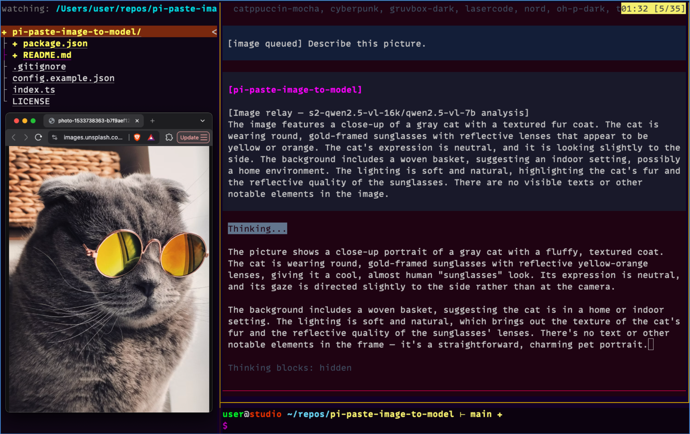

# 🖼️ pi-paste-image-to-model



Paste an image in the [Pi Coding Agent](https://pi.dev) TUI, and have it
**relayed to a vision (VL) model together with recent chat context and your
prompt** — with the analysis injected back into your main (text-only) model's
context.

Use it when your everyday coding model is text-only (or you just don't want to
pay vision-model prices per turn) but you still want the model to "see"
screenshots, error shots, UI mockups, and photos you paste.

```
📋 [clipboard] ──ctrl+v──▶ queue + "[image queued]" marker in editor
⏎ [submit]   ─────────▶ marker stripped; image + history tail + your prompt
                       sent to your VL model (from models.json)
✅ [result]   ─────────▶ VL analysis injected as a persistent message:
                        "[Image relay — <provider>/<model> analysis] ..."
```

The injected message is visible in the transcript **and** in the main model's
LLM context, so it can act on the image's contents without ever receiving the
raw pixels.

## 📦 Install

Three ways — `pi install` writes to `~/.pi/agent/settings.json` (use `-l` for
project settings instead):

**1️⃣ Local path — works right now, no publishing needed:**

```bash
pi install /Users/user/repos/pi-paste-image-to-model
```

Local paths are added to settings without copying; pi loads the extension
through the `pi` manifest in `package.json`.

**2️⃣ Git — shareable with the community as soon as you push the repo
(no publishing needed):**

```bash
pi install git:github.com/F1LT3R/pi-paste-image-to-model
```

Pin a version with `@<tag-or-sha>`, e.g. `...@v0.1.0`.

**3️⃣ npm:**

```bash
pi install npm:pi-paste-image-to-model
```

> `npm:` sources resolve against the npm registry, so the package must be
> published for that form to work. Until then, use the local path or git form.

To try it for a single run without installing:

```bash
pi -e /Users/user/repos/pi-paste-image-to-model
```

**🛠️ Or without packages at all** — copy the extension and register it directly:

```bash
cp index.ts ~/.pi/agent/extensions/pi-paste-image-to-model.ts
```

then add it to the `extensions` array in `~/.pi/agent/settings.json`:

```json
"extensions": ["~/.pi/agent/extensions/pi-paste-image-to-model.ts"]
```

## ⚙️ Configuration

All of it is optional and lives in **`~/.pi/agent/paste-image-to-model.json`**
(start from [`config.example.json`](./config.example.json)):

```json
{
  "enabled": true,
  "shortcut": "ctrl+v",
  "provider": "s2-qwen2.5-vl-16k",
  "model": "qwen2.5-vl-7b",
  "historyChars": 6000,
  "marker": "[image queued]"
}
```

| Field          | Type    | Default          | Description                                                        |
| -------------- | ------- | ---------------- | ------------------------------------------------------------------ |
| `enabled`      | boolean | `true`           | Set `false` to disable the whole extension.                         |
| `shortcut`     | string  | `"ctrl+v"`       | Key that reads the clipboard (any Pi `KeyId`, e.g. `"ctrl+alt+v"`). |
| `provider`     | string  | — (required)¹    | Provider id from your `~/.pi/agent/models.json`.                   |
| `model`        | string  | — (required)¹    | Model id from your `~/.pi/agent/models.json` (vision-capable).     |
| `historyChars` | number  | `4000`           | How many **trailing characters** of the conversation to send to the VL model. `0` = no history. |
| `marker`       | string  | `"[image queued]"` | Marker text inserted into the editor when you paste an image.     |
| `relayTimeoutMs` | number | `120000`        | Hard timeout for the VL model call. If it expires you get an error notification and the turn continues without the image — pi can never wedge on a relay. |
| `vlMaxTokens`  | number  | `1024`           | Max tokens the VL model may generate. Small local models can ramble to their max; lower = faster. |

¹ If `provider`/`model` are missing, the shortcut still works but the relay is
skipped with a clear notification telling you to configure them.

**Environment overrides** (take precedence over the file):

| Variable                              | Maps to            |
| ------------------------------------- | ------------------ |
| `PI_PASTE_IMAGE_TO_MODEL_ENABLED`     | `enabled`          |
| `PI_PASTE_IMAGE_TO_MODEL_SHORTCUT`    | `shortcut`         |
| `PI_PASTE_IMAGE_TO_MODEL_PROVIDER`    | `provider`         |
| `PI_PASTE_IMAGE_TO_MODEL_MODEL`       | `model`¹           |
| `PI_PASTE_IMAGE_TO_MODEL_HISTORY_CHARS` | `historyChars`   |
| `PI_PASTE_IMAGE_TO_MODEL_RELAY_TIMEOUT_MS` | `relayTimeoutMs` |
| `PI_PASTE_IMAGE_TO_MODEL_VL_MAX_TOKENS`    | `vlMaxTokens`    |

¹ The `_MODEL` variable accepts either a bare model id or `"provider/modelId"`.

> Config changes take effect after `/reload` (or restarting pi).

### ⌨️ Keybinding note (default `ctrl+v`)

Pi's built-in `app.clipboard.pasteImage` (default `ctrl+v`) would conflict with
this extension's shortcut. If you use `ctrl+v`, unbind the built-in one in
`~/.pi/agent/keybindings.json`:

```json
{ "app.clipboard.pasteImage": [] }
```

Pick a different `shortcut` instead and you don't need to touch this.

## 🧰 Requirements

- 🍎 **macOS** for clipboard image reading (uses `osascript` with
  `«class PNGf»`, the same mechanism as pi-image-tools). Text clipboard
  fallback works on macOS too. Linux/Windows clipboard providers are a TODO.
- 👁️ A **vision-capable model** registered in your Pi model registry
  (`~/.pi/agent/models.json`) with working auth. Local servers (vLLM, llama.cpp,
  …) and API providers both work — the extension only needs a
  `provider`/`model` pair that `ctx.modelRegistry.find()` can resolve.

## 📤 What gets sent to the VL model

One user message containing:

1️⃣ A fixed relay instruction (you are the image relay for a text-only model).
2️⃣ The tail of the current conversation (user/assistant text plus one-line
   tool-call summaries), truncated to the last `historyChars` characters.
3️⃣ Your current prompt text (the text you wrote alongside the pasted image).
4️⃣ The image(s) themselves, as base64 `image` content blocks.

The VL model's text answer is then injected as a persistent custom message
(`[Image relay — <provider>/<model> analysis] …`) before the main model's turn
starts. The raw image is **not** attached to your user message.

## 🛠️ Agent tool: `image_describe`

The extension also registers a tool the **agent can call itself**:

| Parameter | Type | Description |
| --------- | ---- | ----------- |
| `path`    | string (required) | Path to the image file (png/jpg/webp/gif); relative paths resolve against the working directory. |
| `prompt`  | string (required) | Your question or context for the VL model about the image — what you need from it. The VL model sees no other context (no conversation history), so be specific. |

Example of what the LLM sees as the tool result:

```
image_describe({ "path": "/tmp/screenshot.png", "prompt": "what's the error in this terminal?" })
→ <the VL model's analysis, as plain text>
```

The TUI call line shows your query alongside the target file:

```
image_describe "what's the error in this terminal?" → /tmp/screenshot.png
```

The image never reaches the main model — only the text analysis does, as a
normal tool result. This lets the agent inspect screenshots, photos, and
diagrams on its own (e.g. right after taking a screenshot with a shell
command) without you pasting anything.

## 🧠 How the main model learns to handle relayed images

The relayed text is framed so the text-only model isn't surprised by it:

- 📋 **Paste path:** when a relayed image injects the custom message, the same
  `before_agent_start` hook returns a per-turn `systemPrompt` telling the
  model the message is a vision model's description of the user's image,
  that it should treat it as the image's contents, and that it must not
  invent visual details or claim to have seen pixels.
- 🛠️ **Tool path:** the `image_describe` tool description, its `promptGuidelines`,
  and a one-line header on every tool result all say the same thing — the
  returned text is your only view of the image, it is a third-party reading
  (may contain small errors), and if it conflicts with the user, the user
  wins.

No AGENTS.md entry is needed; the guidance ships with the extension and
applies to anyone who installs it.

## 🚧 If a relay looks stuck

The VL call is bounded: a JS-side timer (`relayTimeoutMs`, default 120 s)
**and** the provider `timeoutMs` both abort it, and the `image_describe` tool
also follows your interrupt. On timeout you get a notification and your turn
starts anyway. If relays are slow or failing:

1️⃣ Check the VL server is up: `curl -s <baseUrl>/v1/models`.
2️⃣ Lower `vlMaxTokens` — small models asked to be "thorough" can generate
   thousands of tokens, which on a consumer GPU means minutes of invisible
   waiting.
3️⃣ Lower `historyChars` — the relay sends the history tail to the VL model.
4️⃣ Use a faster VL model/provider.

## 🙏 Credits

This extension is based on
[**pi-image-tools**](https://github.com/MasuRii/pi-image-tools) by
[**MasuRii**](https://github.com/MasuRii) — specifically its trigger
mechanism: registering a custom paste shortcut, reading clipboard images on
macOS, queueing images with an editor marker, and stripping the marker via the
`input` event transform. Thanks MasuRii for building such a well-structured
package to learn from!

Built on the [Pi Coding Agent](https://pi.dev) extension API
(`pi.registerShortcut`, the `input` and `before_agent_start` events,
`ctx.modelRegistry.complete()`, `ctx.sessionManager.getBranch()`).

## 📄 License

[MIT](./LICENSE)
